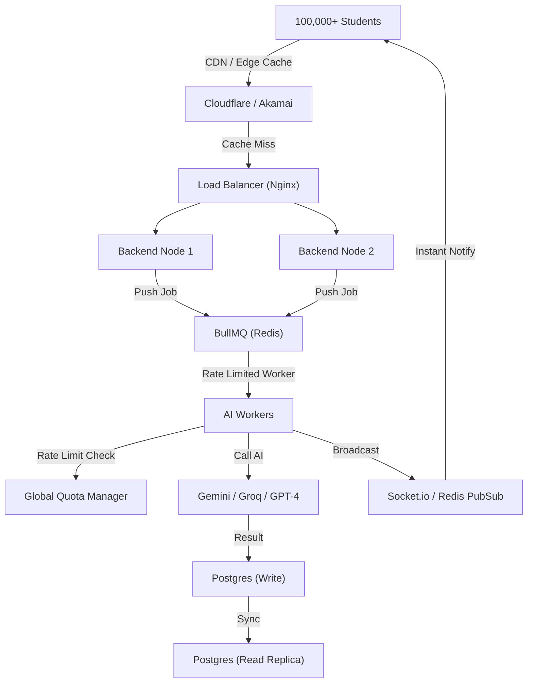

# High-Scale Architectural Audit: 100,000+ Concurrent Users

As the system architect, I have audited the current **eRankUp AI Explanation Pipeline** to evaluate its readiness for a sudden scale of 1L+ (100,000+) concurrent users. 

## 1. Identified Bottlenecks (Current State)
*   **In-Memory Queuing**: The current `AIQueueService` uses a JavaScript array. Under 100k load, a server restart would lose all pending requests, and single-process execution prevents horizontal scaling (adding more servers doesn't help).
*   **AI Rate Limit Exhaustion**: 100,000 concurrent students would hit Gemini/Groq rate limits within seconds, causing massive 429 Errors.
*   **Thundering Herd Problem**: Multiple students clicking "Generate" for the same popular question would trigger redundant AI calls, wasting cost and tokens.
*   **Synchronous Polling**: The current dashboard relies on the component state for status. 100k users polling the backend every 5 seconds would create a "DDOS effect" on the database.

## 2. The 1L+ Scale Roadmap (Proposed Enhancements)

### Phase 1: Distributed Orchestration (Immediate)
- **Redis-Backed Queues (BullMQ)**: Move from in-memory arrays to a persistent Redis queue. This allows 10 backend instances to share the same workload.
- **Request Coalescing (Pooling)**: Implement a "Job Locker" where if 1,000 users request the same `questionId`, ONLY ONE AI call is fired. All 1,000 users are "parked" until that single job completes.

### Phase 2: Multi-Tier Caching & CDNs
- **L1 Edge Cache (Cloudflare)**: Serve popular explanations via a globally distributed CDN. 90% of traffic should never even hit our origin servers.
- **L2 Redis Cache**: Store pre-tokenized explanations for millisecond retrieval.

### Phase 3: Real-Time Event Bus
- **WebSockets / SSE**: Replace polling with a Socket.io server. The backend "pushes" the completion event to the specific student, reducing DB load by 95%.
- **Read Replicas**: Route all "List Explanation" traffic to a read-only PostgreSQL replica.

## 3. High-Scale Topology

## 4. Architect's Verdict
By transitioning to a **Distributed Queue** and **Edge-First Caching**, the eRankUp platform can comfortably handle 100k+ concurrent users with a predictable cost-per-explanation ratio.
